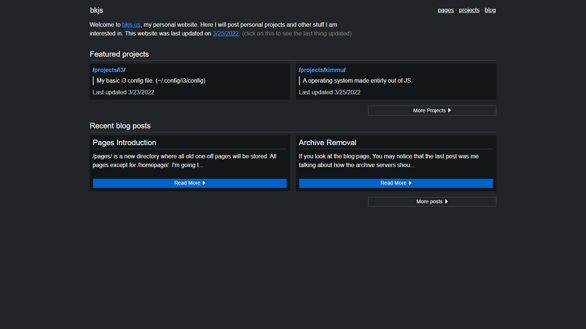

<!-- PROJECT LOGO -->
 

    

  <h3 align="center">bkjs.us</h3>

  

    The source code to my personal website!
     
    <a href="https://bkjs.us"><strong>Take a look at my website »</strong></a>

  

<!-- ABOUT THE PROJECT -->
## About The Project

I created this website as a easy way to see all of my projects along with blog posts about updates with those projects.
I have had many websites in the past, but this one is the most organized and well looking.

(<a href="#top">back to top</a>)

### Built With

I created this website with the most basic of tools so that anyone can see the source code and I can edit it with ease.

* [HTML]([https://nextjs.org/](https://developer.mozilla.org/en-US/docs/Web/HTML))
* [CSS](https://reactjs.org/](https://developer.mozilla.org/en-US/docs/Web/CSS))
* [JS]([https://vuejs.org/](https://developer.mozilla.org/en-US/docs/Web/Javascript))

(<a href="#top">back to top</a>)

<!-- GETTING STARTED -->
## File Structure

The default page the user will see is /homepage/index.html, this is because I setup a autoredirect to that page from the root index.html file

All pages are stored in /pages/, all projects are stored in /projects/ and all blog posts are also stored in /blog/. These all have their own directory lists and are very nice to use as a user.

## Page Manipulation/Creation
This section of the README will explain how to create a page and what type of page.

### Root Pages
To create a page in root, copy a exsiting page and change the title and to contents.
The URL should look like `bkjs.us/page-title/`
All exsisting pages use id='nav' for their navigation bars. 

### Nested Page
For nested pages, `bkjs.us/prev-directory/page-title/` make sure you change all elements, like the linking of script.js and of style.css, to have ../../ before all of the titles. Also change the navigation id to id='nav2'

### Updating Navigation Bar
To update the navigation bar, go into the script.js file and change the contents for 'nav' and 'nav2'. Nav2 is for nested pages while the default nav is for root pages.

(<a href="#top">back to top</a>)

<!-- ROADMAP -->
## Roadmap

- [x] Create Github Repo
  - [x] Create readme file explaining site
- [ ] Add Assets Directory Viewer
- [ ] Add Custom 404 Page
- [ ] Add Favicons to all pages

(<a href="#top">back to top</a>)

<!-- ACKNOWLEDGMENTS -->
## Acknowledgments

I got all of the CSS and HTML from [sr.ht](https://sr.ht). I really liked how their site looked so I just cloned all the HTML and CSS and changed it up ALOT.

(<a href="#top">back to top</a>)

